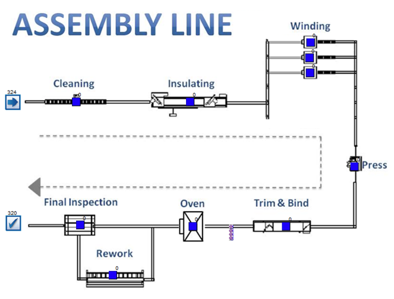
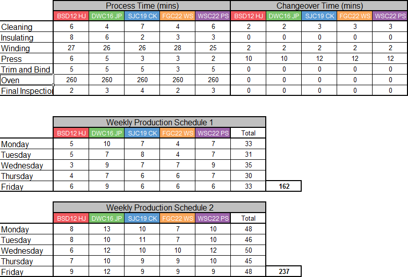
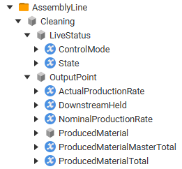

Python script for live playback of simulated factory event data
through OPC UA, operating as either a server or a client.

Requires opcua-asyncio (https://github.com/FreeOpcUa/opcua-asyncio)

	pip install asyncua

## Usage

	python run_sim.py -p basic

Further command line option information:

	usage: python run_sim.py [-h] [-p PRESET] [-t] [-c] [-e ENDPOINT] [-n NAME]
	                  [-f FEED_FILE] [-s TIMESTAMP] [-b TIMESTAMP] [-x SPEED]

	Provides live OPC UA data from a CSV feed of simulated factory events

	options:
	  -h, --help       show this help message and exit
	  -p PRESET        Name of base configuration preset to use from presets.cfg

	override preset settings:
	  -t, --tmc_model  Use the TMC-based model instead of the basic model
	  -c, --client     Write the data to a separate server as a Python client
	  -e ENDPOINT      Endpoint to host / Endpoint to target as client
	  -n NAME          Name to use for Python server (if hosting)
	  -f FEED_FILE     Filename of CSV with simulation data
	  -s TIMESTAMP     Skip to given time in feed file before writing anything
	  -b TIMESTAMP     Begin live playback by fast-forwarding to given time
	  -x SPEED         Playback speed multiplier

## Data

Input consists of a list of factory events produced from a simulation of an 
electric motor assembly line with 10 stations, some working in parallel, 
and one working on batches of parts:

The average process times and changeover times depend on the station and the 
part type, and the amount of each part type depends on a weekly production schedule:

The data is formatted as a CSV included in `/data` with 1 year of events. 
Timestamps are represented as minutes relative to the beginning of the simulation.
Additional properties of the work item involved in the event are included as well.

Data sample:

| Object | Timestamp | Event_Name | Event_Value | Serial_Num | Type_ID | OvenBatch | Reworked | ShiftID |
| --- | --- | --- | --- | --- | --- | --- | --- | --- |
|... |  |  |  |  |  |  |  |  |
| Cleaning | 380.91313 | Work_In | 1 | 3 | 1 |  |  | 1 |
| Cleaning | 380.91313 | State | 1 | 3 | 1 |  |  | 1 |
| Insulating | 386.39065 | State | 2 | 1 | 1 |  |  | 1 |
| Insulating | 386.39065 | Work_Out | 1 | 1 | 1 |  |  | 1 |

Description of event names and values:
| Event_Name | Event_Value description |
| --- | --- |
| Work_In | Number of parts contained in the factory station |
| Work_Out | Number of parts remaining in the factory station |
| State_Change | New state of event |

State values (later converted to PackML enum in OPC UA):
| Event_Value | Decription |
| --- | --- |
| 0 | Starved |
| 1 | Working |
| 2 | Blocked downstream |
| 3 | Changeover between part types |
| 5 | Off shift |
| 6 | Lack of staff |
| 7 | Scheduled maintenance |

The script will provide the data through OPC UA representations of each station
in the assembly line:

## Configuration Presets

Can be added/edited in `presets.cfg`, determines the base settings 
for how to write the data and where to write it to.

	[basic]
	server_name = Python Sim
	endpoint = opc.tcp://0.0.0.0:4840/freeopcua/server/

	[basic_client]
	write_as_client = True
	endpoint = opc.tcp://localhost:53530/OPCUA/SimulationServer

	[tmc_client]
	use_tmc = True
	write_as_client = True
	endpoint = opc.tcp://localhost:53530/OPCUA/SimulationServer

## OPC UA Nodesets

The simulation can write to one of two information models:
* One leveraging the TMC companion spec (https://github.com/OPCFoundation/UA-Nodeset/tree/latest/TMC)
* A more basic nodeset mirroring the TMC structure using base OPC data types

If using a separate OPC UA server, import the instance nodeset for the desired
information model, which will add a folder of `AssemblyLine` stations to
`Objects` corresponding to the data feed: 
* Basic model types + instances - `nodesets/SimBasic.xml`
* TMC instances - `nodesets/SimInstancesTMC.xml`

If using the TMC-based model, the required companion nodesets are also included:
* DI 1.03.0 - `nodesets/DI.xml`
* PackML 1.01 - `nodesets/PackML.xml`
* TMC v2 2.00.1 - `nodesets/TMC.xml`
